<div align="center">

<!-- DASHBOARD BANNER -->


<br/>

<!-- TYPING -->


</div>

 <!-- GLOW LINE -->
 
<p align="center">
  
</p>

<!-- WHOAMI -->

<p align="left">
  
</p>

```bash
┌──(RAWSAN㉿SHADOW)-[~]
└─$ CAT PROFILE.TXT

  NAME      :  MOHAMED RAWSAN
  HANDLE    :  J-M-RAWSAN
  PRONOUN   :  HE / THEY
  AGE       :  0x26 YEARS
  DEGREE    :  BTECH IN CYBER SECURITY
  STAATUS   :  IN THE SHADOW 🟣
  INTERNING :  SYNTECXHUB
  FUN FACT  :  RABBITS CAN SEE BEHIND THEM
               WITHOUT MOVING THEIR HEADS 🐇
```

 <!-- GLOW LINE -->
 
<p align="center">
  
</p>

<!-- LIVE STATUS BOARD -->

<p align="left">
  
</p>

<div align="center">

  

  

  <br>

  

</div>

 <!-- GLOW LINE -->
 
<p align="center">
  
</p>


<!-- TECH STACK -->

<p align="left">
  
</p>

<p align="center">
  
  
  
  
  
  
  
  
  
  
  
  
</p>

 <!-- GLOW LINE -->
 
<p align="center">
  
</p>

<!-- SKILL MATRIX HEADER -->

<p align="left">
  
</p>

<div align="center">

`┌──────────────────────────────────────────────────────────────┐`  
`│                    HACKER SKILL GRAPH                        │`  
`├──────────────────────────────────────────────────────────────┤`  
`│ PYTHON        ██████████████████░░░░░░   90%                 │`  
`│ CYBER SEC     ████████████████░░░░░░░░   78%                 │`  
`│ HTML / CSS    ██████████████░░░░░░░░░░   72%                 │`  
`│ JAVASCRIPT    ████████████░░░░░░░░░░░░   60%                 │`  
`│ JAVA          ███████████░░░░░░░░░░░░░   55%                 │`  
`│ SQL / MYSQL   ███████████░░░░░░░░░░░░░   58%                 │`  
`└──────────────────────────────────────────────────────────────┘`

</div>


<!-- ANIMATED SCANNER TEXT -->
<p align="center">
  

 <!-- GLOW LINE -->
 
<p align="center">
  
</p>


<!-- TROPHIES -->

<p align="left">
  
</p>

<div align="center">


</div>

 <!-- GLOW LINE -->
 
<p align="center">
  
</p>

<!-- CONTRIBUTION SNAKE -->

<p align="left">
  
</p>

<picture>
  <source
    media="(prefers-color-scheme: dark)"
    srcset="https://raw.githubusercontent.com/platane/snk/output/github-contribution-grid-snake-dark.svg"
  />
  <source
    media="(prefers-color-scheme: light)"
    srcset="https://raw.githubusercontent.com/platane/snk/output/github-contribution-grid-snake.svg"
  />
  
</picture>

 <!-- GLOW LINE -->
 
<p align="center">
  
</p>

<!-- CYBER QUOTE HEADER -->

<p align="center">
  
</p>

<!-- QUOTE CARD -->

<p align="center">
  
</p>


 <!-- GLOW LINE -->
 
<p align="center">
  
</p>

<div align="center">
  
</div>

<p align="center">
  
  
<p align="center">
  
</p>

<p align="center">
<a href="https://spotify-github-profile.kittinanx.com/api/view?uid=31dwltg6aeal2mldyds7lfqplkb4&redirect=true">
 
</a>

<p align="center">
  
</p>
  
</p>
<p align="center">
  
</p>

<p align="center">
  
</p>


 <!-- GLOW LINE -->
 
<p align="center">
  
</p>

<!-- CONNECT -->

<p align="left">
  
</p>
<div align="center">
<a href="https://twitter.com/realrawsan"></a>&nbsp;
<a href="https://linkedin.com/in/j-m-raushan-a2b93b3ab"></a>&nbsp;
<a href="mailto:an.rawsan@gmail.com"></a>&nbsp;
<a href="https://github.com/J-M-Rawsan"></a>
</div>

 <!-- GLOW LINE -->
 
<p align="center">
  
</p>

<table width="100%" style="border:none; border-collapse:separate; border-spacing:14px;">
<tr>

<td align="left" valign="top" width="48%" style="border:1px solid #00F5FF; background:#020617;">

<br>

<br>


<br>

<br>


</td>

<td align="center" valign="top" width="48%" style="border:1px solid #00F5FF; background:#020617;">

<br>

<br>

<br>


</td>

</tr>
</table>

 <!-- GLOW LINE -->
 
<p align="center">
  
</p>

<div align="center">


*♟️ Stay in the shadows...*
</div>

<!-- GLOWING BADGES -->
<p align="left">
  
  
  
</p>


<!-- Proudly created with Rawsan -->

<!-- HACKER SKILL MATRIX GRAPH STYLE -->

